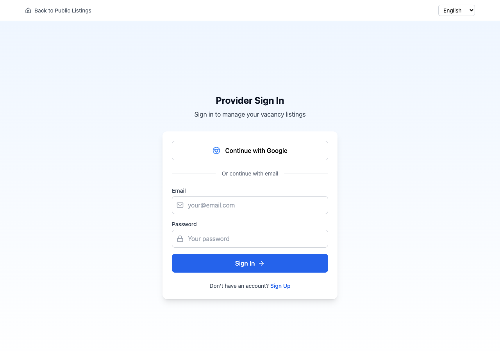
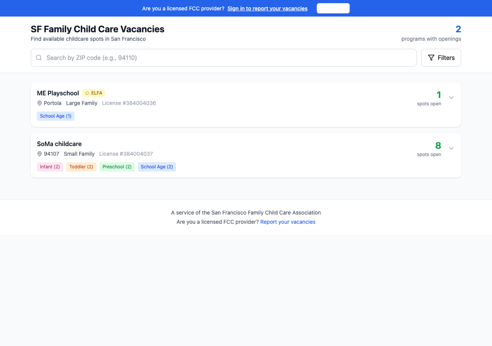
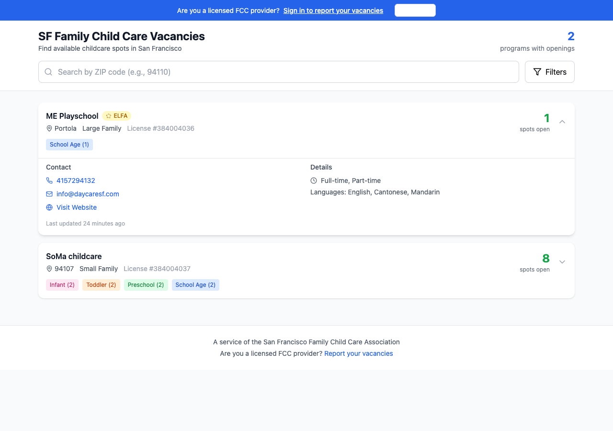

# SF Family Child Care Vacancy Registry
## Provider Guide (Beta)

Welcome to the SF Family Child Care Vacancy Registry! This platform helps licensed Family Child Care providers in San Francisco report their vacancies and connect with families looking for childcare.

---

## Getting Started

### 1. Sign Up / Sign In
- Visit the platform and click "Report your vacancies"
- You can sign in with Google or create an account with your email
- First-time users will be guided through a setup process

*Sign in with Google or email to access your provider dashboard*

### 2. Verify Your License
- Enter your 9-digit California FCC license number
- The system will verify your license with the state database
- ELFA network membership is automatically detected

### 3. Complete Your Profile
- Business name (what families will see)
- Program type (Small Family up to 8 children, or Large Family up to 14)
- Location (ZIP code and neighborhood)
- Contact information (phone, email, website)
- Languages spoken

---

## Key Features

### Public Listing
Your program appears on the public search page where families can find you:

*The main search page where families look for childcare*

Families can filter results by neighborhood, age group, language, and schedule:

*Filter options help families find the right match*

When families click on a listing, they see more details:

*Expanded view shows contact info and program details*

### Report Vacancies
Tell families about your available spots:
- **By age group**: Infant (under 2), Toddler (2-3), Preschool (3-5), School Age (6+)
- **Schedule options**: Full-time, Part-time, or both
- **Availability date**: When spots open up
- **Waitlist**: Let families know you accept waitlist signups even when full

### Roster Management
Track your enrolled children (optional but helpful):
- Add children with just their date of birth (names are optional for privacy)
- The system automatically calculates ages and age groups
- See upcoming openings as children age out or transition to kindergarten
- Auto-fill your vacancy form based on your roster

### Capacity Projections
Plan ahead with automatic calculations:
- See when children will transition between age groups
- Know when spots will open due to kindergarten starts
- California infant ratio compliance is built-in

---

## Reporting as "Full"

If you have no current openings:
- Set all spots to 0
- Check "Waitlist available" if you accept waitlist signups
- Your program will appear in the "Currently Full" section
- Families can still contact you to join your waitlist

---

## Tips for Providers

1. **Keep your listing updated** - Families rely on accurate information
2. **Update when things change** - New opening? Child leaving? Update right away
3. **Use the roster feature** - It helps predict future openings automatically
4. **Check the "Waitlist" box** - Even when full, families want to plan ahead

---

## Beta Testing - We Need Your Feedback!

This platform is currently in beta testing. Your input is invaluable in making it better for all SF FCC providers.

### Please share:
- **Challenges you face** with managing vacancies and enrollment
- **Features you'd like to see** added to the platform
- **Bugs or issues** you encounter while using the system
- **Ideas for improvement** based on your experience

### How to submit feedback:
Please send your feedback to: **oscar.fccasf@gmail.com**

Include:
- What you were trying to do
- What happened (or didn't happen)
- Any suggestions you have

Your feedback directly shapes how this platform develops. Thank you for being part of making childcare more accessible in San Francisco!

---

## Questions?

If you have questions or need help, please contact: **Oscar Tang** at **oscar.fccasf@gmail.com**

---

*This is a beta version. Features may change based on provider feedback.*
